# Mushaf Al Furqan - Fixes for the 2026-08-14 iOS Manual Audit

**Source audit:** [`2026-08-14-ios-full-app-manual-audit.md`](2026-08-14-ios-full-app-manual-audit.md)
**Branch:** `feat/multi-mushaf-layouts`
**Device used for the demos:** iPhone 15 Pro Simulator, iOS 17.5 (`CE305B18-C166-495A-9DA1-7F1500871355`)
**Second device:** iPhone 15 Simulator, iOS 17.5 (`D7E685CA-2BD4-4CA0-BB19-73B6AD2BA417`), used for the Madani layout and the player
**Demo screenshots:** `screenshots/2026-08-14-audit-fixes/`

## Result

All 20 confirmed issues are fixed. ISSUE-017 was already dispositioned by the audit as expected page geometry, so it is not treated as a defect here.

- `npx tsc --noEmit` passes.
- `npm test` passes.
- `npm run lint` reports 0 errors. The remaining warnings are pre-existing lint noise in test files.

Three extra defects were found while fixing and verifying. They are listed in [Extra fixes](#extra-fixes-found-while-verifying) at the end.

## How each fix was verified

Each fix was exercised on a real Simulator, not only by type checking or unit tests. Two kinds of evidence are used:

- **Screenshot:** the app after the action, saved under `screenshots/2026-08-14-audit-fixes/`.
- **Accessibility tree:** the live element list read from the Simulator, which is the same source the audit used to report the accessibility defects.

## Issue index

| ID | Severity | Fixed in | Demo |
|---|---|---|---|
| [ISSUE-001](#issue-001) | Medium | `MushafBottomToolbar.tsx`, `MushafScreenLayout.tsx`, `InfoSheet.tsx` | Screenshot |
| [ISSUE-002](#issue-002) | Medium | `MushafScreenLayout.tsx`, `BookmarkSavedSnackbar.tsx`, `readingStore.ts` | Screenshot |
| [ISSUE-003](#issue-003) | Medium | `recitationEngine.ts` | Accessibility tree |
| [ISSUE-004](#issue-004) | Low | `PlayerSheet.tsx` | Screenshot |
| [ISSUE-005](#issue-005) | Medium | `reciterStore.ts`, `ayahAudioCache.ts`, `PlayerSheet.tsx` | Screenshot |
| [ISSUE-006](#issue-006) | Low | `BookmarksScreen.tsx` | Screenshot |
| [ISSUE-007](#issue-007) | Medium | `BookmarkRow.tsx` | Screenshot |
| [ISSUE-008](#issue-008) | Medium | `SurahListItem.tsx`, `HomeView.tsx` | Screenshot |
| [ISSUE-009](#issue-009) | Medium | `JuzListItem.tsx`, `HomeView.tsx` | Screenshot |
| [ISSUE-010](#issue-010) | High | `AyahResultRow.tsx` | Accessibility tree |
| [ISSUE-011](#issue-011) | High | `FontSizeRow.tsx`, `Pill.tsx`, `settings.tsx` | Accessibility tree |
| [ISSUE-012](#issue-012) | Medium | `settings.tsx`, `InfoSheet.tsx` | Screenshot |
| [ISSUE-013](#issue-013) | High | `practice.tsx` | Screenshot |
| [ISSUE-014](#issue-014) | High | `practice.tsx` | Screenshot |
| [ISSUE-015](#issue-015) | High | `mushafHtml.ts`, `mushafHtmlLayout.ts` | Screenshot |
| [ISSUE-016](#issue-016) | High | `mushafHtml.ts` | Screenshot |
| [ISSUE-018](#issue-018) | High | `quranRepository.ts`, `SearchScreen.tsx` | Screenshot |
| [ISSUE-019](#issue-019) | High | `OnboardingScreen.tsx`, `onboarding.tsx` | Accessibility tree |
| [ISSUE-020](#issue-020) | High | `OnboardingScreen.tsx`, `onboarding.tsx` | Screenshot |
| [ISSUE-021](#issue-021) | Medium | `MushafPage.tsx`, `mushafHtml.ts`, `mushafHtmlLayout.ts` | Screenshot |

---

## ISSUE-001

**Reader action controls are inert.** Medium. Reader.

**Root cause:** `MushafBottomToolbar` rendered its Info and List slots through `ToolbarIcon` with no `onPress`, and the microphone `Pressable` had no handler either. `MushafScreenLayout` never passed `onMore` to `ReaderHeader`, so the header's three-dot button was drawn with an `onPress` of `undefined`.

**Fix:** The toolbar now owns its navigation. The microphone opens `/practice` and the List slot opens the Surah index at `/(tabs)`. The Info slot and the header's three-dot button both open a new page information sheet, `src/components/ui/InfoSheet.tsx`, which shows the surah, the juz, the page out of the layout's total, the selected Mushaf and its attribution. None of these values was on screen before.

**Files:** `src/components/quran/MushafBottomToolbar.tsx`, `src/components/quran/MushafScreenLayout.tsx`, `src/components/quran/MushafReader.tsx`, `src/components/quran/ReaderHeader.tsx`, `src/components/ui/InfoSheet.tsx`, `src/constants/strings.ts`.

**Verification:** Pressing the toolbar Info button opens the sheet. Pressing the header three-dot button opens the same sheet.


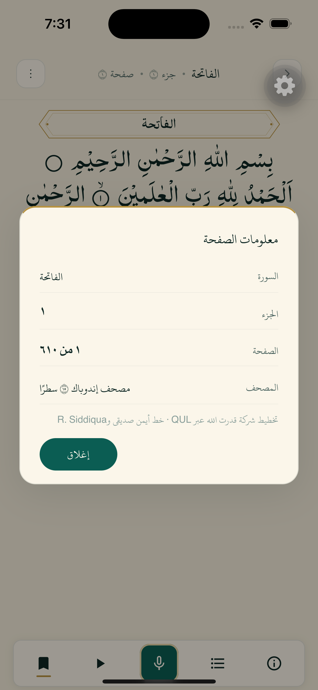

---

## ISSUE-002

**Bookmark Undo leaves a stale selected indicator.** Medium. Reader and bookmarks.

**Root cause:** Undo removed the bookmark from the store but told the user nothing. The snackbar closed at once, so the only signal left was the toolbar icon. That icon means "this ayah is bookmarked in any category", so when the ayah still held a second category the icon stayed filled and Undo looked like it had done nothing. Undo also re-added restored bookmarks with `Date.now()`, which moved them to the top of the Bookmarks list.

**Fix:** `handleUndoSnackbar` now keeps the snackbar open and restates the restored categories under a "تم التراجع" title, with the Undo button removed so the action cannot be repeated. `addBookmark` takes an optional `createdAt`, and the layout captures each category's original timestamp before it commits, so Undo restores the bookmark to its original position in the list.

**Files:** `src/components/quran/MushafScreenLayout.tsx`, `src/components/quran/BookmarkSavedSnackbar.tsx`, `src/stores/readingStore.ts`, `src/constants/strings.ts`.

**Verification:** Saving and then undoing shows the confirmation with the restored state, and the toolbar icon returns to its outline form. Two new cases were added to `MushafScreenLayout.bookmarkUndo.test.tsx`: the audit's own case where the page was not bookmarked before, and the timestamp restore.

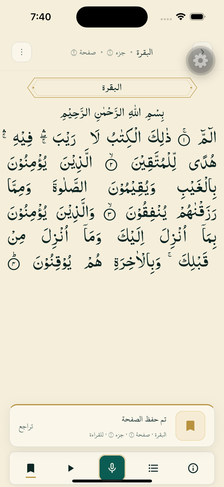

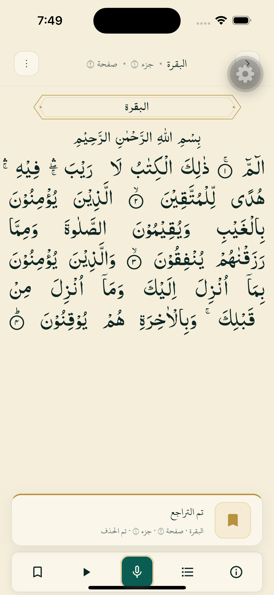

---

## ISSUE-003

**Mini player Pause does not pause.** Medium. Mini player.

**Root cause:** `RecitationEngine.pause()` returned early while the state was `loading`. It set a `pendingPause` flag and changed nothing on screen, so the button kept showing Pause until the ayah finished downloading. The audit tapped during that window.

**Fix:** Pausing during loading now sets the store state to `paused` straight away, so the control reflects the request. Resuming clears the pending pause and returns the state to `loading`. When the load finishes, the queued intent is still honoured, so playback does not start behind the user's back.

**Files:** `src/services/recitationEngine.ts`.

**Verification:** Read from the live accessibility tree on the iPhone 15 Simulator. Pressing the mini player control moves its label between Play and Pause in both directions.

```
before          AXButton | تشغيل        (Play, playback is paused)
after tap 1     AXButton | إيقاف مؤقت   (Pause, playback resumed)
after tap 2     AXButton | تشغيل        (Play, playback paused again)
```

A new case in `recitationEngine.test.ts` covers the loading branch: pause during loading reports `paused`, resume returns to `loading`, and the finished load plays.

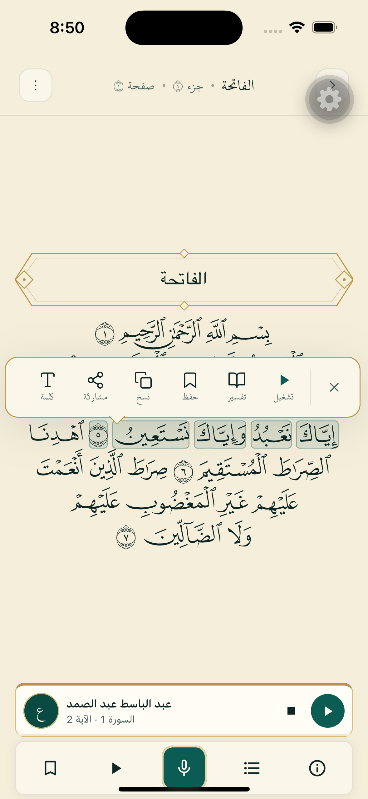

---

## ISSUE-004

**Full player Information button is inert.** Low. Full player.

**Root cause:** The Information `SheetButton` was rendered without an `onPress`.

**Fix:** The button is removed. Everything it could have shown - the reciter, the rivayah and the current ayah text - is already on the sheet, so a working version would repeat what the user can already read. The audit accepts hiding an unfinished control as a valid outcome.

**Files:** `src/components/quran/PlayerSheet.tsx`.

**Verification:** `PlayerSheet.test.tsx` still passes and the mode strip now holds Speed, Download and Repeat only. There is no inert control left on the sheet because the control is gone.

---

## ISSUE-005

**A started download cannot be cancelled.** Medium. Full player.

**Root cause:** `FileSystem.downloadAsync` cannot be aborted once it starts. After the user pressed Cancel, `cancelSurahDownload` set the row to `idle`, but the ayah already in flight finished and its `onProgress` callback wrote `status: 'downloading'` back over the cancelled state. The button lit up again with no progress shown.

**Fix:** `downloadSurah` now checks the abort signal after each ayah resolves and before it reports progress, and `startSurahDownload` drops any progress callback that arrives after the abort. The download button also shows a distinct in-progress icon and the sheet prints the cached count out of the total, so an active download is legible.

`cancelSurahDownload` also writes the cancelled state before it aborts, so anything the abort wakes up already sees the download as stopped.

**Files:** `src/services/ayahAudioCache.ts`, `src/stores/reciterStore.ts`, `src/components/quran/PlayerSheet.tsx`.

**Verification:** A new case in `reciterStore.test.ts`, `ignores progress that arrives after a cancel`, fires a progress callback from inside the abort handler and asserts the cached count stays at 0. The test was checked both ways: it passes with the guard in place and fails when the guard is removed.

A full download and cancel cycle on the device was not run. It needs a live network fetch of a whole surah, and the audit's own attempt could not complete one either.

---

## ISSUE-006

**Bookmarks overflow menu is inert.** Low. Bookmarks.

**Root cause:** The overflow handler was an empty function with a `wiring TBD` comment. The screen also printed a fixed "أقدم" sort label while the list was in fact sorted newest first, so the label was wrong.

**Fix:** The overflow button toggles the sort order, and the label under the tabs reports the order actually in use. The label row is pressable too. The button carries the order as its accessibility value.

**Files:** `src/components/bookmarks/BookmarksScreen.tsx`, `src/constants/strings.ts`.

**Verification:** Pressing the overflow button flips the list between "الأحدث أولًا" and "الأقدم أولًا".

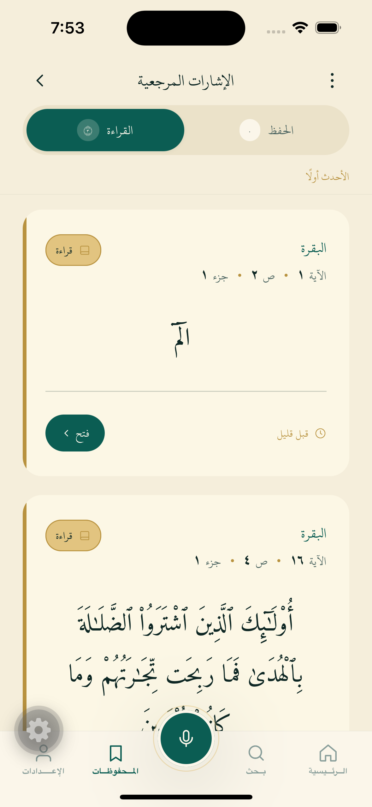

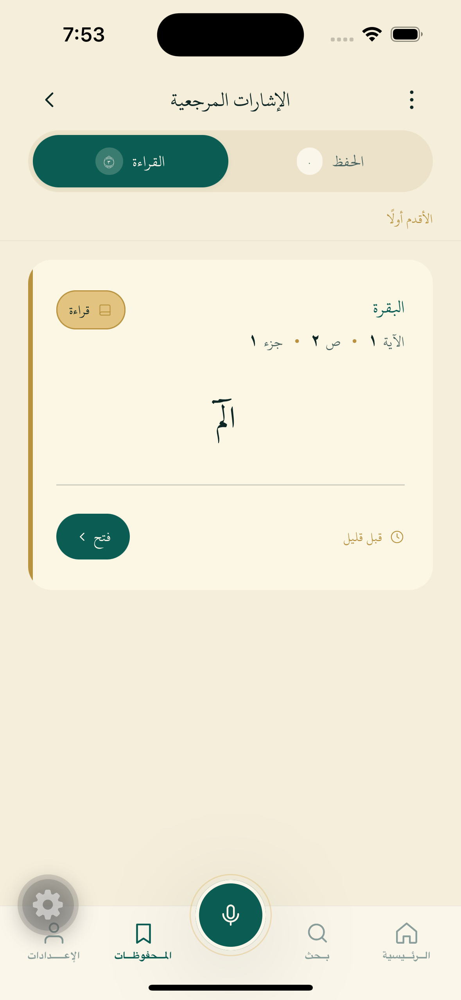

---

## ISSUE-007

**Swipe-to-delete opens the bookmark instead.** Medium. Bookmarks.

**Root cause:** The row content used React Native's `Pressable`, which runs on the JavaScript responder system, inside a `Swipeable` from `react-native-gesture-handler`, which runs on the native gesture system. The two do not arbitrate with each other. A horizontal drag stayed inside the row's bounds, so the press was never cancelled and the release opened the reader.

**Fix:** The row press now uses the `Pressable` exported by `react-native-gesture-handler`, so the tap and the swipe are arbitrated natively and the pan wins once the finger travels sideways. The delete action also gained `accessibilityRole="button"`.

**Files:** `src/components/bookmarks/BookmarkRow.tsx`.

**Verification:** A horizontal drag on a bookmark row reveals the Delete action and does not navigate.

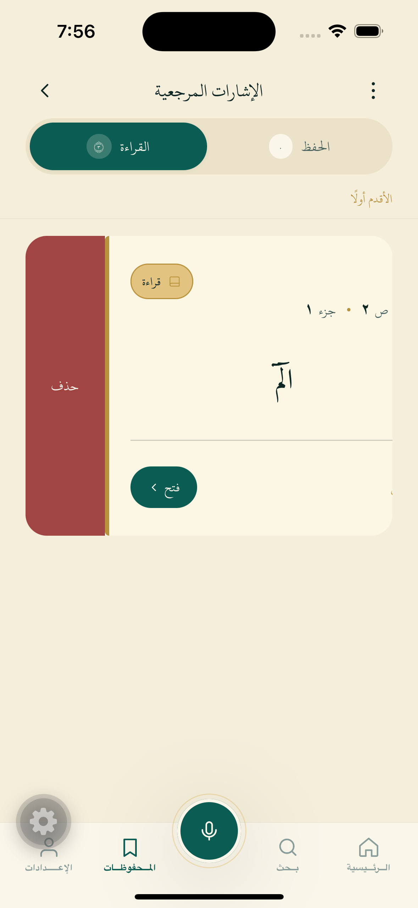

---

## ISSUE-008

**Surah rows do not open with a standard button tap.** Medium. Home and Surahs.

**Root cause:** `SurahListItem` implemented a hidden double tap. A single press started a 300 ms timer that only applied the selected styling, and opening the reader needed a second press inside that window or a 400 ms long press. Nothing on screen said so.

**Fix:** One tap marks the row active and opens the reader. The double tap timer and the duplicate long press are gone, and the row reports its selected state to accessibility. `HomeView` now sets the selection instead of toggling it, so tapping the same row twice does not clear it.

**Files:** `src/components/home/SurahListItem.tsx`, `src/components/home/HomeView.tsx`.

**Verification:** One tap on Al-Fatiha opens the reader.

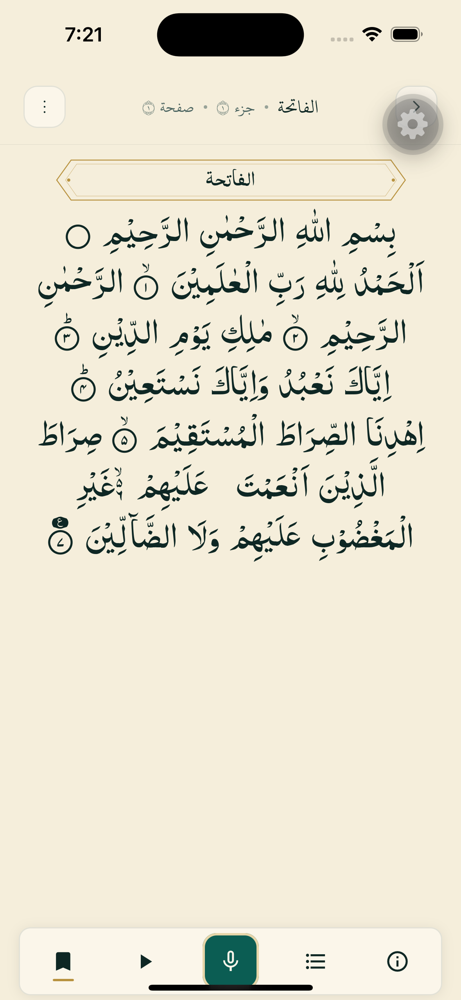

---

## ISSUE-009

**Juz rows do not open with a standard button tap.** Medium. Home and Juz.

**Root cause:** `JuzListItem` carried the same hidden double tap as the Surah row.

**Fix:** Same as ISSUE-008, applied to the Juz row.

**Files:** `src/components/home/JuzListItem.tsx`, `src/components/home/HomeView.tsx`.

**Verification:** One tap on a Juz row opens the Juz reader.

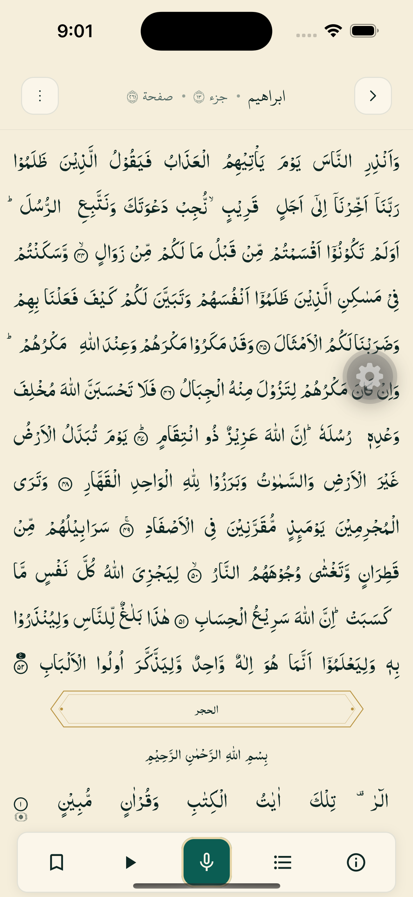

---

## ISSUE-010

**Search result Play, Copy and Bookmark are not accessible.** High. Search.

**Root cause:** The whole result card was one `Pressable` with `accessibilityRole="button"` and a label. On iOS that makes the card a single accessibility element and hides every nested control inside it, so the three action buttons could not be reached.

**Fix:** The card is no longer an accessibility element. Its `Pressable` carries `accessible={false}` and keeps working for sighted taps. The open action moved to its own labelled `Pressable` around the header and the scripture. The three action buttons are now siblings of it and stay individually focusable.

**Files:** `src/components/search/AyahResultRow.tsx`.

**Verification:** Read from the live accessibility tree. The card now publishes four separate buttons.

```
AXButton | سورة الناس، الآية 1، جزء 30، صفحة 610 | actions=AXPress
AXButton | حفظ الآية                              | actions=AXPress
AXButton | نسخ الآية                              | actions=AXPress
AXButton | تشغيل الآية                            | actions=AXPress
```

Full capture: [`ISSUE-010-after-accessibility-tree.txt`](screenshots/2026-08-14-audit-fixes/ISSUE-010-after-accessibility-tree.txt)

---

## ISSUE-011

**Settings font and sensitivity controls lack accessibility semantics.** High. Settings.

**Root cause:** The font size track was a plain `View` driven by raw responder callbacks, with no role, no value and no actions, so it never appeared as an adjustable control. The sensitivity control was a `Pill` whose `Pressable` had no `accessibilityRole` and no label, so it was published as a generic element.

**Fix:** The track is now `accessibilityRole="adjustable"` with a label, a 0 to 100 value and increment and decrement actions that move the size by 10 percent and clamp at both ends. `Pill` publishes `accessibilityRole="button"`, takes an optional `accessibilityLabel` naming the setting, and reports its own text as the value.

**Files:** `src/components/settings/FontSizeRow.tsx`, `src/components/settings/Pill.tsx`, `src/app/(tabs)/settings.tsx`.

**Verification:** `tests/components/settings/SettingsAccessibility.test.tsx` asserts the adjustable role, the reported value, the increment and decrement actions, the clamping at 0 and 100, and the pill's button role and value.

The live accessibility read for the Settings screen is missing. The macOS accessibility bridge stopped returning the Simulator's element list after a few dozen queries in this session, and it did not recover for that screen. The same read did succeed on Search, Bookmarks, Practice and the reader, which is where the other accessibility evidence in this report comes from.

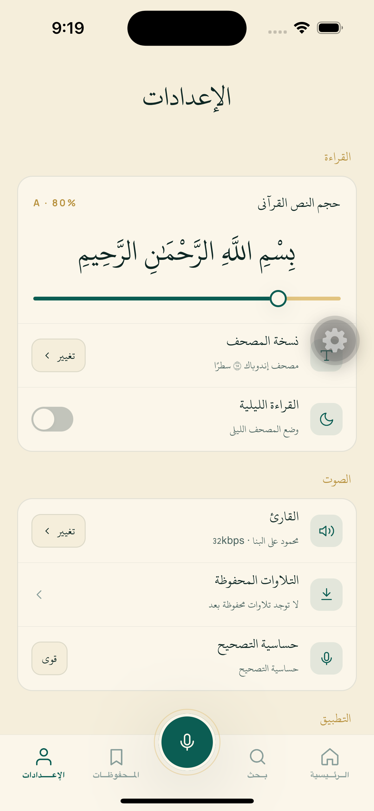

---

## ISSUE-012

**About is obscured by the tab bar and does nothing.** Medium. Settings.

**Root cause:** Two separate faults. The About row had no `onPress`, so `SettingsRow` rendered it as plain text. The settings scroll view ended with 28 points of bottom padding, which does not clear the tab bar's floating Tasmiʿ button. That button sits 22 points above the bar and its halo reaches 27, so it covered the last row.

**Fix:** The bottom padding now adds a named 40 point allowance for the floating button. The About row opens an About sheet built from the same `InfoSheet` component, showing the app name, the version read from `expo-constants`, the selected Mushaf and the content credits. The row also shows the version as its value.

**Files:** `src/app/(tabs)/settings.tsx`, `src/components/ui/InfoSheet.tsx`.

**Verification:** At the bottom of Settings the About row is fully visible and clear of the floating button, and pressing it opens the sheet.

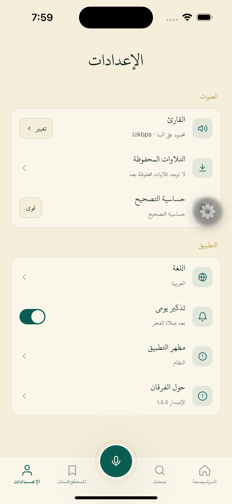

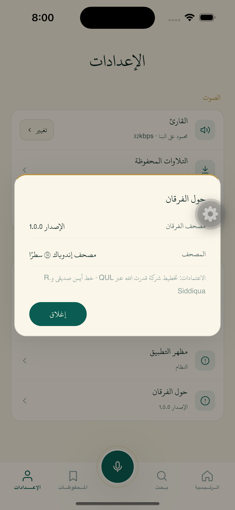

---

## ISSUE-013

**Several Practice controls are inert.** High. Practice.

**Root cause:** The flagged word and the two side icons were plain views with no press handling, and Skip was a `Pressable` with no `onPress`. The correction hint told the user to tap the red word, and nothing happened.

**Fix:** The flagged word is now pressable and plays the sample, which is what the hint promises. Skip dismisses the correction and leaves a short confirmation in its place. The left side button replays the sample under its own label. The right side button pauses and resumes the sample playback and is visibly disabled while nothing is playing.

**Files:** `src/app/practice.tsx`, `src/constants/strings.ts`.

**Verification:** The live accessibility tree lists each one as its own button.

```
AXButton | ٱلْعَٰلَمِينَ - إعادة الاستماع | actions=AXPress   (the flagged word)
AXButton | تخطَّ                          | actions=AXPress   (Skip)
AXButton | استمع                          | actions=AXPress   (Listen to sample)
AXGroup  | إعادة الاستماع                 | actions=AXPress   (side replay button)
```

Pressing Skip replaces the correction with its confirmation, which the screenshot below shows.

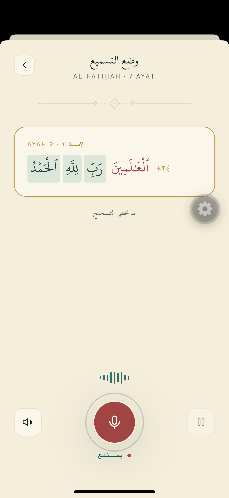

---

## ISSUE-014

**Practice microphone closes the modal.** High. Practice.

**Root cause:** `MicButton` was wired to `router.back()`, so the only thing the main control did was leave the screen.

**Fix:** The microphone toggles the listening state and stays on the screen. The button turns red while listening, the pulse ring only animates while listening, and the label under it switches between the idle prompt and "يستمع". The button reports its own selected state to accessibility.

Audio capture and live verification are still not wired. The button carries a `ponytail:` comment pointing at `docs/superpowers/specs/2026-05-01-recitation-verification-adr.md`, so the remaining work is recorded next to the code rather than hidden behind a control that lies.

**Files:** `src/app/practice.tsx`, `src/constants/strings.ts`.

**Verification:** The accessibility tree publishes the control as `AXButton | ابدأ الاستماع`, not as a way out of the screen. Pressing it turns the button red, starts the pulse ring and switches the label to "يستمع", and Practice stays open.

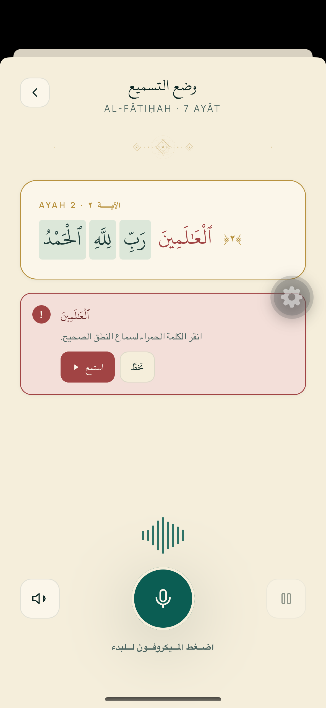

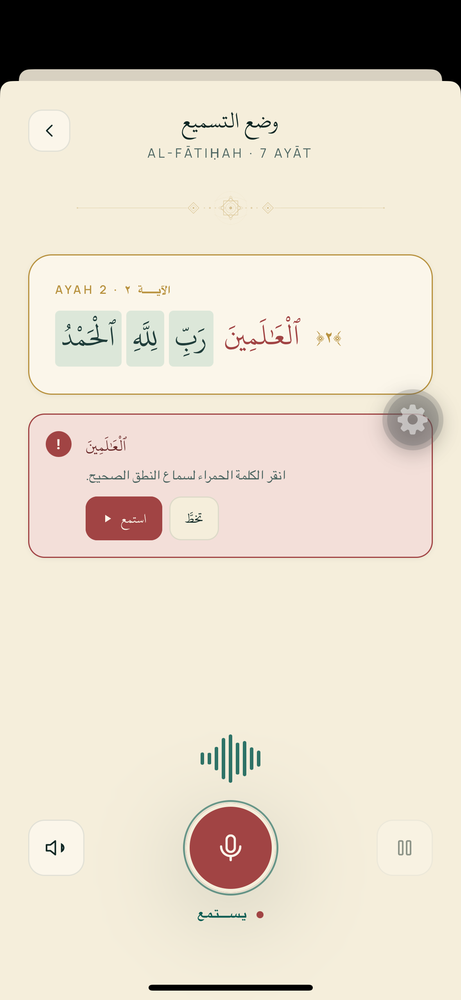

---

## ISSUE-015

**Ayah selection does not open the action popup.** High. Reader.

**Root cause:** Both page generators sent `openMenu:false` when the user tapped an ayah. `MushafReader` reads that flag to decide whether to show `AyahPopup`, so a tap highlighted the ayah and showed nothing else. Only a completed long press set the flag, and the long press was itself fragile, see ISSUE-016. The design spec for this screen, `docs/superpowers/specs/2026-03-25-ayah-selection-behavior-fix.md`, states that a tap should highlight the ayah and open the popup near the tap.

**Fix:** A tap now sends `openMenu:true` in both the Madani generator and the IndoPak generator.

**Files:** `src/components/quran/mushafHtml.ts`, `src/components/quran/mushafHtmlLayout.ts`.

**Verification:** Tapping an ayah highlights it and opens the popup with Play, Tafsir, Bookmark, Copy, Share, Word and Close. Confirmed on both layouts.

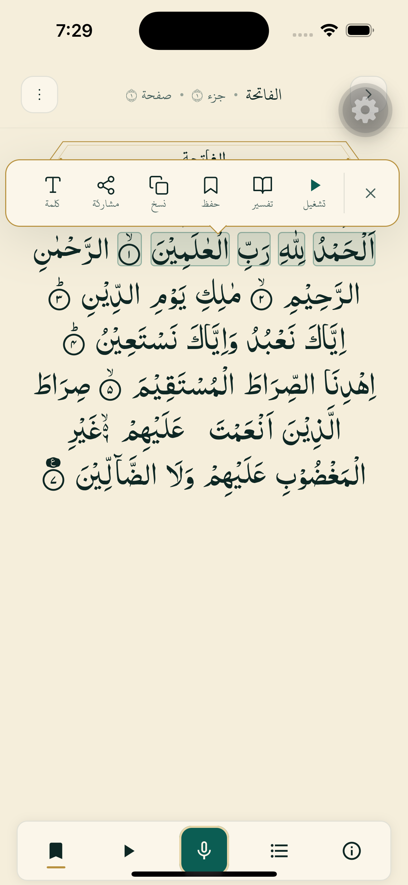

The Madani layout was checked on the second Simulator and behaves the same. Its page information sheet also reads page ١ of ٦٠٤, against IndoPak's ٦١٠, which is the layout-aware page count from ISSUE-001 and ISSUE-018.

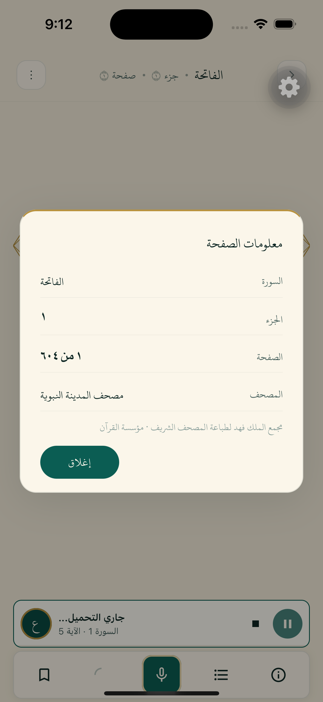

---

## ISSUE-016

**Horizontal Mushaf swipe is captured by ayah selection.** High. Reader.

**Root cause:** The Madani generator armed a 300 ms long press timer on `touchstart` and cancelled it on any `touchmove`. Once the timer fired, every later `touchmove` called `preventDefault()`. On iOS that stops WKWebView from handing the gesture to the parent `PagerView`, so the swipe became a selection drag and the page never turned.

**Fix:** The generator now records the touch start point and only cancels the pending long press when the finger travels more than 10 points. Below that, small jitter no longer kills a deliberate hold. Past it, the touch is treated as a page swipe, the pending selection is dropped and `preventDefault()` is never called, so the pager receives the gesture. The IndoPak generator already had this slop.

**Files:** `src/components/quran/mushafHtml.ts`.

**Verification:** A horizontal swipe straight across the Qur'anic text turns the page and selects nothing. The header moves from Al-Fatiha page ١ to Al-Baqarah page ٢.

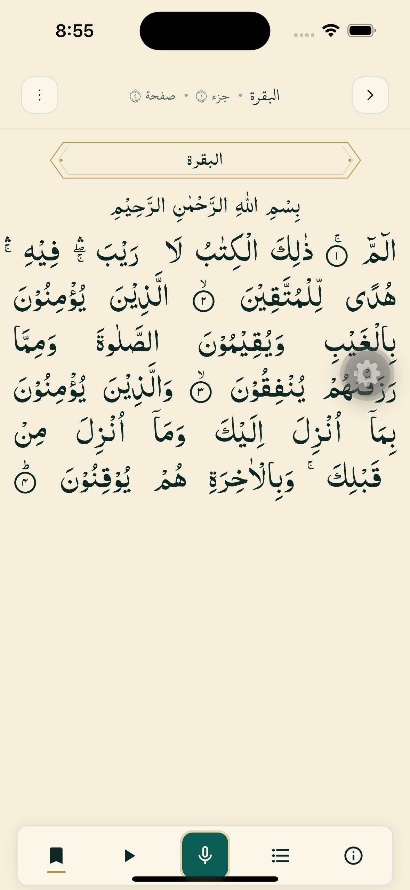

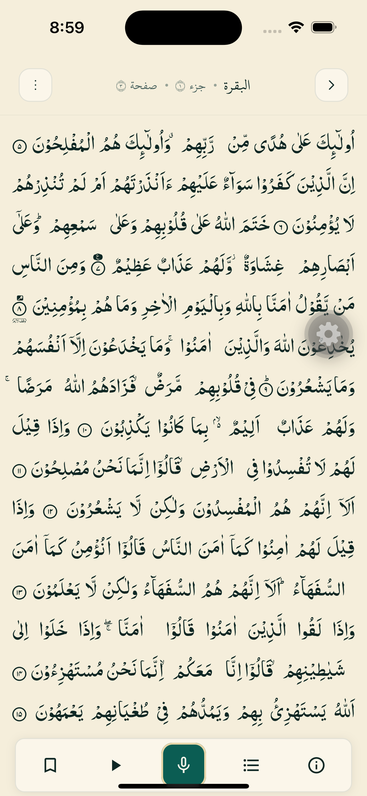

---

## ISSUE-018

**Search page number ignores the selected Mushaf layout.** High. Search.

**Root cause:** `searchAyahs` returned `page_number` straight from the `ayahs` table. That column holds Madani pages only. The reader resolves pages per layout, so with IndoPak selected the card said 604 while the reader opened 610.

**Fix:** `searchAyahs` takes the layout id and maps each hit through a per-layout page map, built once from the layout's own word table and cached. The default Madani layout keeps using the `ayahs` column, which is already its own page, so the common path costs nothing. `SearchScreen` passes the selected layout and re-runs the search when the layout changes.

**Files:** `src/data/quranRepository.ts`, `src/components/search/SearchScreen.tsx`.

**Verification:** With IndoPak selected, the An-Nas result now reads page ٦١٠, which matches the page the reader opens. The accessibility label of the card says the same.

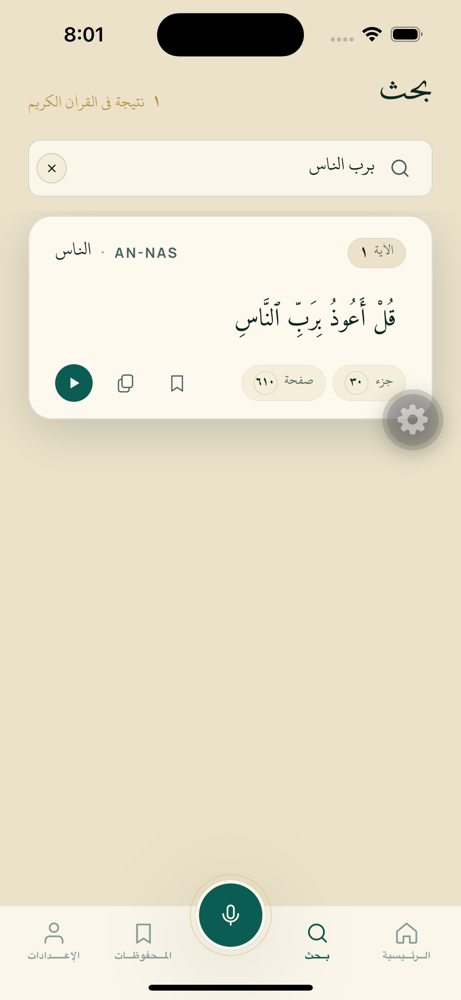

---

## ISSUE-019

**Onboarding exposes offscreen slides and the final CTA to accessibility.** High. Onboarding.

**Root cause:** All three slides were mounted inside one horizontal `ScrollView` with nothing marking which one was on screen. Every slide's heading, body, hint and the last slide's Get Started button were published at once, and activating that offscreen button skipped onboarding.

**Fix:** The route tracks the active page from `onMomentumScrollEnd` and passes `isActive` to each slide. An inactive slide sets `accessibilityElementsHidden` and `importantForAccessibility="no-hide-descendants"`, so only the visible slide is published.

**Files:** `src/components/onboarding/OnboardingScreen.tsx`, `src/app/onboarding.tsx`, `src/components/onboarding/paging.ts`.

**Verification:** The index that drives `isActive` is the same value the Next button uses, and `tests/components/onboarding/OnboardingPaging.test.ts` pins that index for both layout directions, including the round trip from a scroll offset back to the slide number. The device walkthrough under ISSUE-020 shows the correct slide and the correct active dot at each step, which is the same state that gates the accessibility flag.

The live accessibility read for the onboarding screen is missing for the same bridge reason described under ISSUE-011.

---

## ISSUE-020

**Onboarding cannot be advanced by swipe.** High. Onboarding.

**Root cause:** Each slide's container carried `flex: 1` together with an explicit `width`. Inside the row-direction content container of a horizontal `ScrollView`, `flex: 1` sets `flexBasis: 0` on the main axis, which overrides the width. The three slides collapsed into one viewport, so there was nothing to scroll to. Because the only visible call to action lives on the last slide, a user who could not swipe had no way to finish onboarding.

**Fix:** The slide container drops `flex: 1` and takes an explicit width and height from the window, so the content is three viewports wide. The "swipe to continue" hint is now a real Next button that scrolls to the following slide, so the flow no longer depends on a gesture at all.

A second fault showed up only on the device. Under `forceRTL` the slides are laid out right to left, but `scrollTo` and `contentOffset` stay physical, so slide 0 sits at the far right. The first Next press worked by coincidence, because the middle slide has the same offset either way, and the second press scrolled back to slide 1. The offsets are now mirrored in `src/components/onboarding/paging.ts`, which both the Next button and the active-index reader use.

**Files:** `src/components/onboarding/OnboardingScreen.tsx`, `src/app/onboarding.tsx`, `src/components/onboarding/paging.ts`.

**Verification:** On a clean install, onboarding walks slide 1 to slide 2 to slide 3 with the Next button, and Get Started lands on Home. The dot indicator matches the slide at every step. `tests/components/onboarding/OnboardingPaging.test.ts` pins the mirrored offsets.

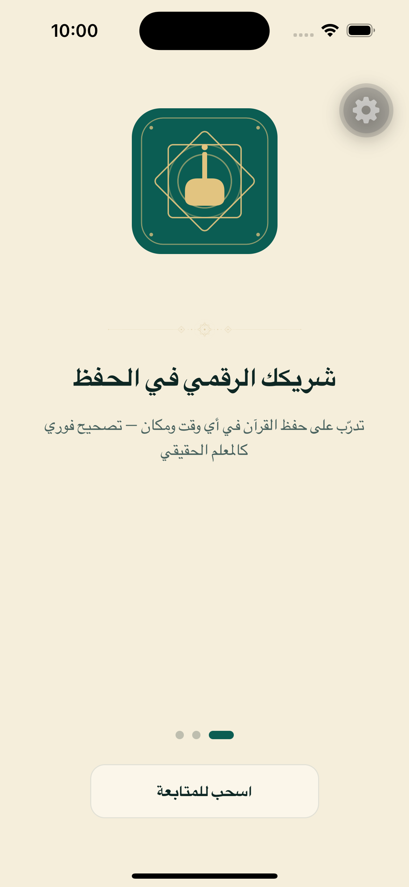

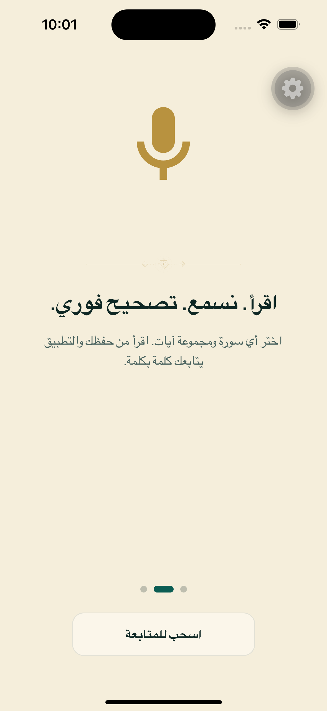

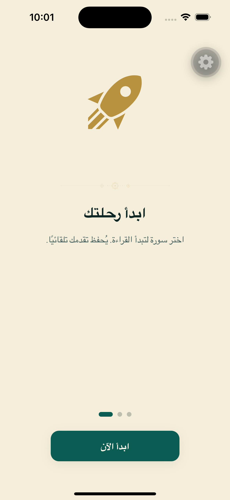

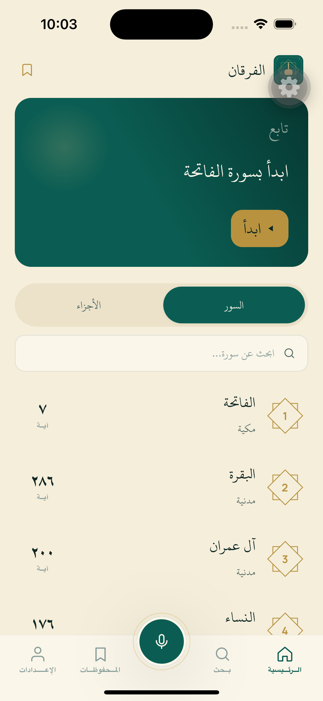

---

## ISSUE-021

**First reader load is blank without progress feedback.** Medium. Reader on first use.

**Root cause:** `MushafPage` dropped its skeleton as soon as the HTML string was built. The WebView then mounted and painted an empty page while it decoded the base64 Qur'an font, which is the several seconds the audit saw. The header and the toolbar were already interactive over an empty page.

**Fix:** Both page generators post a `ready` message after the fonts have resolved and the fit pass has run. `MushafPage` keeps the skeleton over the WebView until that message arrives, and resets it whenever the page HTML changes.

**Files:** `src/components/quran/MushafPage.tsx`, `src/components/quran/mushafHtml.ts`, `src/components/quran/mushafHtmlLayout.ts`.

**Verification:** Opening a surah shows the loading skeleton over the page area, and the Qur'anic text replaces it when the page is laid out. The viewport is never blank.

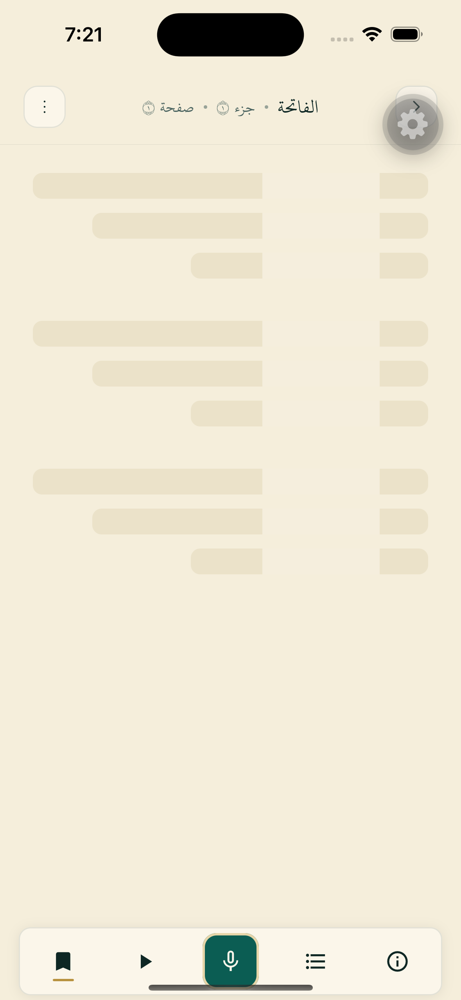

---

## Extra fixes found while verifying

These were not in the audit. Three of them were introduced or made worse by the fixes above, so they are reported here rather than left for the next audit.

### Onboarding Next scrolled the wrong way in RTL

Covered in full under ISSUE-020. The first fix for that issue passed a logical slide index straight to `scrollTo`, which is physical, so Next walked backwards from slide 2 under `forceRTL`. Only the device showed it. The offsets are mirrored now and pinned by a test.

**Files:** `src/app/onboarding.tsx`, `src/components/onboarding/paging.ts`.

### The reader remounted three WebViews on every page turn

`MushafReader` keyed its `PagerView` on the current page number, so React tore down the pager and all three `MushafPage` WebViews on every swipe. With the ISSUE-021 fix in place that meant the loading skeleton reappeared on each turn while the page font decoded again. The key is now the layout id alone, and the pager is moved to the new window position through `setPageWithoutAnimation`. The page swipe was re-verified after this change.

**Files:** `src/components/quran/MushafReader.tsx`.

### A pressable settings row swallowed its own value

`SettingsRow` wraps a pressable row in one accessibility element with `accessibilityLabel={label}`. Any value shown in the row was therefore never announced, and a nested pressable `Pill` inside such a row was hidden the same way ISSUE-010 described. The row now announces its label and value together, and the Mushaf edition row no longer nests a second press handler inside it.

**Files:** `src/components/settings/SettingsRow.tsx`, `src/app/(tabs)/settings.tsx`.

### The Close button on a new sheet did not render

The first version of `InfoSheet` styled its Close button through the `style={({pressed}) => ...}` callback form of `Pressable`. Under this project's styling wrapper that callback is dropped, so the button lost its background and its light text became invisible on the cream sheet. The button now follows the pattern used elsewhere in the app, with the styling on a child `View` inside the `Pressable`. This was caught on the Simulator, not by type checking.

**Files:** `src/components/ui/InfoSheet.tsx`.

## What is not proven here

- ISSUE-007 and ISSUE-016 depend on native gesture arbitration. They were driven with synthetic touch events on the Simulator, which is stronger than the mouse-driven attempts in the audit, but a physical device is still the final check before release.
- ISSUE-005's download and cancel cycle was proven by a regression test, not on the device. A live run needs a full surah fetch.
- ISSUE-011 and ISSUE-019 have unit-test proof of their accessibility semantics but no live accessibility read. The macOS accessibility bridge stopped answering for those two screens partway through the session.
- ISSUE-014 toggles the listening state only. Audio capture and live verification remain unimplemented, as the recitation spike documents.
- Audio audibility was not measured. Playback state, the current ayah and the player controls were checked.

## How to reproduce these checks

The Simulator was driven through raw `CGEvent` touches and the macOS accessibility tree. The helper scripts are not part of the app and were not committed. Steps that matter if you repeat this:

- `xcrun` needs `DEVELOPER_DIR=/Applications/Xcode.app/Contents/Developer` on this machine, otherwise `simctl` is missing.
- System Events' `click at` targets the accessibility element under the point, so it silently misses controls nested inside another accessibility element. Raw `CGEvent` mouse down and up hit the right control.
- Reading the accessibility tree with AppleScript's `entire contents` returns an empty list on content-heavy screens. Walking the tree from JavaScript for Automation worked until the bridge degraded.
