# Mushaf Al Furqan — Full iOS Manual Feature Audit

**Audit date:** 2026-08-14  
**App/branch:** `feat/multi-mushaf-layouts`  
**HEAD baseline:** `6081a460bf3f55a6b0a4fb167220b0918f8d43f0`  
**Worktree:** `/Users/ahmeddaraz/Work/open-source/worktrees/alfurqan/feat-multi-mushaf-layouts`  
**Device:** iPhone 15 Pro Simulator, iOS 17.5 (`CE305B18-C166-495A-9DA1-7F1500871355`)  
**Build:** Debug, `com.ahmeddaraz.alfurqan`, built from the worktree's complete uncommitted multi-layout implementation  
**Method:** real Simulator UI operated with Computer Use; screenshots and the native accessibility tree were inspected after each action. Source was used only to corroborate a manually observed result.

## Executive result

All eight route-level pages were opened and every unique reachable control family was exercised. The audit also covered the bookmark and reciter sheets, Mushaf layout picker, mini player, full player, snackbar/Undo flow, both shipped Mushaf layouts, Surah and Juz entry points, and representative high-risk Mushaf pages.

- **20 confirmed issues:** 9 high, 9 medium, 2 low.
- **Core flows that work:** resume reading, Search result navigation, copy, audio start/stop, bookmark creation/removal, Settings persistence, theme/language changes, layout switching by canonical ayah, Surah/Juz reader routes, and correct end-of-Qur'an layout mapping.
- **Most important defects:** onboarding cannot be traversed normally in this Simulator run; reader swiping conflicts with ayah selection; the ayah action popup does not open; Practice contains several inert controls and its microphone closes the modal; Search displays the Madani page number while IndoPak is selected.
- **Qur'anic-content disposition:** the sparse opening spread on pages 1–2 is expected for these layouts and is **not** reported as a defect. A normal IndoPak page (42) fills 15 lines, and verified boundary/end pages preserve authoritative ayah and Surah boundaries.

The original Simulator app data was backed up before destructive test setup and restored afterward. The restored Home screen was manually verified to show the original resume location: Al-Baqarah 2:16, Juz 1, IndoPak page 4.

## Scope and interpretation of “all pages”

“All pages” here means every route-level application page plus every distinct reachable modal, sheet, expansion, and action surface. A Mushaf has hundreds of content pages; those are one reader route with data-driven page content, not hundreds of separate app routes. Representative content pages were therefore selected for opening, normal, multi-Surah boundary, layout-mapping, and final-page risk.

### Application page map

| # | Route/surface | Entry point used | Coverage |
|---|---|---|---|
| 1 | `/onboarding` | Fresh app state after safe backup | All three slides' intended navigation, CTA, persistence, accessibility exposure |
| 2 | `/(tabs)/index` — Home | Completion/normal launch | Greeting/resume, Surah/Juz segments, search/clear, list rows, brand shortcut, all bottom tabs |
| 3 | `/(tabs)/search` — Quran Search | Search tab | Idle/loading/results/no-results, clear, result open/play/copy/bookmark |
| 4 | `/(tabs)/bookmarks` — Bookmarks | Bottom tab and brand shortcut | Reading/Recitation tabs, empty state, row open, overflow, swipe/delete |
| 5 | `/(tabs)/settings` — Settings | Settings tab | Font, layout, palette, reciter, saved recitations, sensitivity, language, reminder, appearance, About |
| 6 | `/practice` — Practice modal | Center microphone tab | Back, sample audio, word/correction actions, side controls, microphone |
| 7 | `/surah/[id]` — Surah reader | Home, Search, Resume | Header, pager, ayah selection, toolbar, bookmarks, mini/full player, both layouts |
| 8 | `/juz/[id]` — Juz reader | `alfurqan://juz/1` through iOS/Safari confirmation | Juz route resolution, initial location, reader shell, Back |

### Reachable secondary surfaces

- Bookmark category sheet, backdrop dismissal, both category chips, Remove All, saved snackbar, Undo.
- Mushaf layout picker and its Close action.
- Reciter picker with all five visible reciters.
- Night-reading palette with all four modes.
- Saved-recitation expansion and empty state.
- Mini player and full player, including transport, speed, repeat, reciter, download, seek, information, and Close.
- Ayah popup was expected but could not be reached because of ISSUE-015.

## Control-by-control coverage matrix

Legend: **Pass** = visible state/navigation changed as expected; **Fail** = confirmed issue; **Blocked** = downstream state could not safely or reliably be created; **Observed** = state was visible but an external effect could not be independently confirmed.

### Onboarding

| Control/flow | Result | Notes |
|---|---|---|
| Horizontal swipe between three slides | **Fail** | Repeated left/right swipes and horizontal scroll gestures stayed on slide 1; ISSUE-020. |
| “Get Started” on final slide | **Pass, but incorrectly exposed** | The offscreen slide-3 CTA was discoverable/clickable from slide 1 in the accessibility tree; ISSUE-019. |
| Completion state | **Pass** | CTA entered Home and onboarding did not immediately return. |
| Fresh-user “Start” card | **Pass** | Opened Al-Fatiha reader; first render lacked a loading state for several seconds; ISSUE-021. |

### Home

| Control/flow | Result | Notes |
|---|---|---|
| Brand bookmark shortcut | **Pass** | Opens Bookmarks. |
| Resume | **Pass** | Opens saved canonical location. |
| Fresh-user Start | **Pass** | Opens Al-Fatiha. |
| Surah/Juz segmented controls | **Pass** | List content changes. |
| Home search field and Clear | **Pass** | Filters Surahs and restores the list. |
| Surah row standard tap | **Fail** | Only applies selected styling; does not open reader; ISSUE-008. |
| Juz row standard tap | **Fail** | Same hidden double-tap/long-press design; ISSUE-009. |
| Home/Search/Bookmarks/Settings/Practice bottom controls | **Pass** | Each destination opened. |

### Quran Search

| Control/flow | Result | Notes |
|---|---|---|
| Empty, loading, result, no-result states | **Pass** | Each state rendered. |
| Search and Clear | **Pass** | Query changed and cleared. |
| Open result card | **Pass** | Opens the requested canonical Surah/ayah in the selected layout. |
| Play, Copy, Bookmark actions | **Pass visually** | Coordinate activation worked. Copied pasteboard text was `الْحَمْدُ لِلَّهِ رَبِّ الْعَٰلَمِينَ ﴿٢﴾`. Nested actions are absent from accessibility; ISSUE-010. |
| Result page metadata | **Fail** | Shows Madani page 604 while IndoPak is selected; reader correctly opens page 610; ISSUE-018. |

### Bookmarks

| Control/flow | Result | Notes |
|---|---|---|
| Reading/Recitation tabs and counts | **Pass** | Both tabs and the empty state work. |
| Bookmark row open | **Pass** | Opens the correct canonical ayah. Page metadata changed by layout (Al-Baqarah 2:16: Madani 3, IndoPak 4). |
| Header Back | **Pass** | Returns to previous screen. |
| Overflow menu | **Fail** | No visible/state change; ISSUE-006. |
| Swipe-to-delete | **Fail** | Both horizontal directions opened the row instead; ISSUE-007. |

### Settings

| Control/flow | Result | Notes |
|---|---|---|
| Qur'an font-size slider | **Pass visually / Fail accessibility** | Changed 80→40→80 by coordinate; absent as a slider from accessibility; ISSUE-011. |
| Mushaf layout picker, Close, Madani, IndoPak | **Pass** | Selector opens/closes; both layouts activate. |
| Canonical layout switch | **Pass** | An-Nas 114:1 remained the location while page changed IndoPak 610→Madani 604. Resume opened 604. |
| Night Reading toggle | **Pass** | Off/on state changed. |
| Classical, Sepia, Pure Ink, Indigo palettes | **Pass** | All four selected; original setting restored. |
| Reciter picker | **Pass** | Husary, Abdul Basit, Al-Sudais, Al-Minshawi, and Al-Banna each selected and updated the row. |
| Saved recitations expansion | **Pass** | Expanded/collapsed and showed empty state. |
| Delete saved recitation | **Blocked** | No completed download was available; download cancellation itself failed in ISSUE-005. |
| Correction sensitivity | **Pass visually / Fail accessibility** | Gentle/Standard/Strict cycled; exposed only as a generic element; ISSUE-011. |
| Arabic/English | **Pass** | Text and RTL/LTR presentation changed, then original Arabic restored. |
| Daily reminder toggle | **Observed** | Store/UI state changed off/on; OS notification scheduling was not visible or independently confirmed. |
| Light/Dark/System | **Pass** | All themes rendered; original System restored. |
| About | **Fail** | Row is obscured behind the floating tab bar at maximum scroll and is inert; ISSUE-012. |

### Practice

| Control/flow | Result | Notes |
|---|---|---|
| Back | **Pass** | Closes modal. |
| Listen to sample | **Pass visually** | Playback state/mini player activated; audio audibility was not measurable through visual automation. |
| Flagged red word | **Fail** | Instruction implies it can be tapped, but no action occurs; ISSUE-013. |
| Skip | **Fail** | No change; ISSUE-013. |
| Side speaker and pause icons | **Fail** | No action and not accessible as controls; ISSUE-013. |
| Main microphone | **Fail** | Immediately closes Practice instead of toggling recording; ISSUE-014. |

### Surah/Juz Mushaf reader and playback

| Control/flow | Result | Notes |
|---|---|---|
| Header Back | **Pass** | Returns to source screen. |
| Header More | **Fail** | No action; ISSUE-001. |
| Horizontal page swipe | **Fail in Simulator** | Gestures over text selected an ayah; margin swipes did not advance. Hardware confirmation advised; ISSUE-016. |
| Ayah select/highlight | **Partial** | Highlight appears, but expected popup/actions do not; ISSUE-015. |
| Bottom Info/List/Practice | **Fail** | All are exposed as controls but inert; ISSUE-001. |
| Bottom Play | **Pass** | Starts playback and mini player. |
| Bookmark open/category/backdrop/Remove All | **Pass** | Sheet opened; both categories, backdrop dismiss, and Remove All worked. |
| Bookmark Undo visual state | **Fail** | Undo did not clear the toolbar's selected indicator; ISSUE-002. |
| Mini-player details and Stop | **Pass** | Details opens full player; Stop returns to idle. |
| Mini-player Pause | **Fail** | State/label did not change; ISSUE-003. |
| Full-player Close, Previous, Next, Stop | **Pass** | Previous/Next changed ayah 16↔17; Close and Stop worked. |
| Full-player seek | **Observed** | Accessibility Increment was accepted, but the 0:00/0:00 timeline gave no visible proof of movement. |
| Reciter picker, Speed, Repeat | **Pass** | Picker works, speed changed 1x→1.25x, repeat indicator toggled. |
| Information | **Fail** | No action; ISSUE-004. |
| Download/cancel | **Fail** | Download entered active state; second tap did not cancel after more than six seconds; ISSUE-005. |
| Juz route and Back | **Pass** | `/juz/1` opened page 1 and Back returned to Home/Juz context. |

## Mushaf content and layout verification

| Layout | Pages inspected | Result/evidence |
|---|---|---|
| IndoPak 15-line | 1, 2, 42, 106, 610 | Page 42 fills 15 lines; page 106 correctly contains the end of An-Nisa and the Al-Ma'idah banner/bismillah/start; page 610 contains Al-Falaq and An-Nas. |
| Madani QCF V2 | 1, 2, 604 | Opening spread rendered; page 604 correctly contains Al-Ikhlas, Al-Falaq, and An-Nas. |
| Cross-layout canonical mapping | Al-Baqarah 2:16 and An-Nas 114:1 | Bookmark location mapped IndoPak 4↔Madani 3. An-Nas mapped IndoPak 610↔Madani 604. |

### Opening pages 1–2: expected special geometry, not a defect

The captured page-2 image initially looked suspicious because of the empty upper rows. Database inspection showed 15 authoritative line records: the opening spread intentionally contains seven text lines plus reserved/empty rows and heading/bismillah rows. The same special 7-line opening-page treatment exists in the Madani layout. Normal IndoPak page 42 fills its 15 canonical lines. Therefore this capture is retained as an audit observation, but it is **not** counted among the issues.

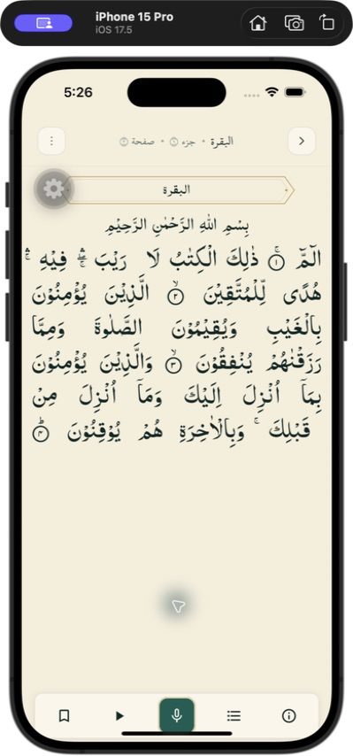

## Issue summary

| ID | Severity | Page | Issue | Evidence |
|---|---|---|---|---|
| ISSUE-001 | Medium | Reader | Header More and bottom Info/List/Practice are inert | [Screenshot](screenshots/2026-08-14-full-app-audit/ISSUE-001-reader-more-no-op.png) |
| ISSUE-002 | Medium | Reader/bookmarks | Undo leaves bookmark toolbar state selected | [Screenshot](screenshots/2026-08-14-full-app-audit/ISSUE-002-bookmark-undo-stale-selected.png) |
| ISSUE-003 | Medium | Mini player | Pause does not pause/change state | [Screenshot](screenshots/2026-08-14-full-app-audit/ISSUE-003-mini-player-pause-no-op.png) |
| ISSUE-004 | Low | Full player | Information button is inert | [Screenshot](screenshots/2026-08-14-full-app-audit/ISSUE-004-player-information-no-op.png) |
| ISSUE-005 | Medium | Full player | Active download cannot be cancelled | [Screenshot](screenshots/2026-08-14-full-app-audit/ISSUE-005-download-cancel-stays-active.png) |
| ISSUE-006 | Low | Bookmarks | Overflow button is inert | [Screenshot](screenshots/2026-08-14-full-app-audit/ISSUE-006-bookmarks-options-no-op.png) |
| ISSUE-007 | Medium | Bookmarks | Swipe-to-delete opens the reader | [Screenshot](screenshots/2026-08-14-full-app-audit/ISSUE-007-bookmark-swipe-opens-reader.png) |
| ISSUE-008 | Medium | Home/Surahs | Standard tap selects row but does not open it | [Screenshot](screenshots/2026-08-14-full-app-audit/ISSUE-008-surah-single-tap-only-selects.png) |
| ISSUE-009 | Medium | Home/Juz | Standard tap selects row but does not open it | [Screenshot](screenshots/2026-08-14-full-app-audit/ISSUE-009-home-list-rows-single-tap-no-navigation.png) |
| ISSUE-010 | High | Search | Result action buttons are missing from accessibility | [Screenshot](screenshots/2026-08-14-full-app-audit/ISSUE-010-search-result-actions-not-accessible.png) |
| ISSUE-011 | High | Settings | Font slider and sensitivity control are not semantically accessible | [Screenshot](screenshots/2026-08-14-full-app-audit/ISSUE-011-settings-slider-and-sensitivity-not-accessible.png) |
| ISSUE-012 | Medium | Settings | About row is obscured and inert | [Screenshot](screenshots/2026-08-14-full-app-audit/ISSUE-012-about-row-obscured-and-inert.png) |
| ISSUE-013 | High | Practice | Red word, Skip, and side controls are inert | [Screenshot](screenshots/2026-08-14-full-app-audit/ISSUE-013-practice-inert-controls.png) |
| ISSUE-014 | High | Practice | Microphone closes modal instead of recording | [Screenshot](screenshots/2026-08-14-full-app-audit/ISSUE-014-practice-mic-closes-modal.png) |
| ISSUE-015 | High | Reader | Ayah selection never presents the action popup | [Screenshot](screenshots/2026-08-14-full-app-audit/ISSUE-015-ayah-long-press-no-popup.png) |
| ISSUE-016 | High | Reader | Horizontal page gesture selects text/does not page | [Screenshot](screenshots/2026-08-14-full-app-audit/ISSUE-016-horizontal-swipe-selects-ayah-instead-of-paging.png) |
| ISSUE-018 | High | Search/layout mapping | Search displays page 604 for an IndoPak page-610 result | [Search](screenshots/2026-08-14-full-app-audit/ISSUE-018-search-page-number-ignores-selected-layout.png), [reader](screenshots/2026-08-14-full-app-audit/ISSUE-018-reader-opens-page610-support.png) |
| ISSUE-019 | High | Onboarding/accessibility | Offscreen slides and CTA are exposed on slide 1 | [Screenshot](screenshots/2026-08-14-full-app-audit/ISSUE-019-onboarding-exposes-offscreen-slides-to-accessibility.png) |
| ISSUE-020 | High | Onboarding | Swipe does not advance beyond slide 1 | [Screenshot](screenshots/2026-08-14-full-app-audit/ISSUE-020-onboarding-swipe-does-not-advance.png) |
| ISSUE-021 | Medium | Reader/first use | Initial reader content is blank for several seconds with no loading state | [Screenshot](screenshots/2026-08-14-full-app-audit/ISSUE-021-first-reader-load-shows-blank-page.png) |

## Detailed issues and reproduction steps

### ISSUE-001 — Reader action controls are inert

**Severity:** Medium  
**Context:** Any Surah or Juz reader page; reproduced on IndoPak page 4.  
**Precondition:** A reader page has rendered.

**Steps to reproduce:**

1. Open Home and tap Resume, or open any Search result.
2. Tap the top-header **More** button.
3. Observe that no menu, sheet, toast, focus change, or navigation appears.
4. Repeat with bottom-toolbar **Information**, **List**, and **Start Practice**.

**Expected:** Each visually enabled button performs its named action or is visibly disabled/marked unavailable.  
**Actual:** All four controls accept a press but produce no change. Source corroboration: the bottom toolbar supplies no handlers for those three buttons.

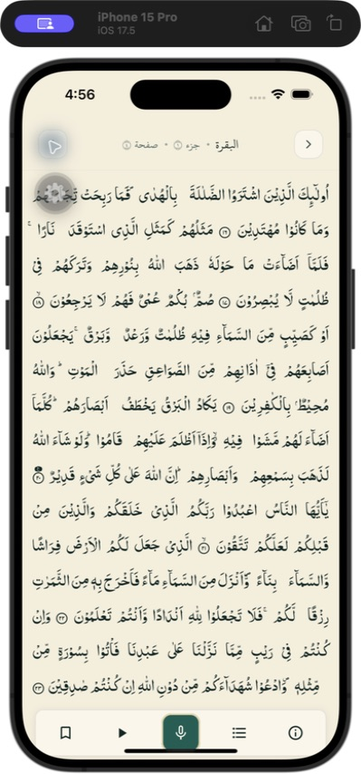

### ISSUE-002 — Bookmark Undo leaves a stale selected indicator

**Severity:** Medium  
**Context:** Reader bookmark toolbar and saved snackbar.  
**Precondition:** Current page is not already bookmarked.

**Steps to reproduce:**

1. Open a reader page and tap the outline bookmark icon.
2. Choose **Reading** in the category sheet.
3. Confirm the toolbar bookmark becomes selected and the saved snackbar appears.
4. Tap **Undo**.

**Expected:** Undo removes the just-created bookmark and immediately returns the toolbar icon to its unselected state.  
**Actual:** The Undo action is accepted, but the filled/selected toolbar state remains visible.

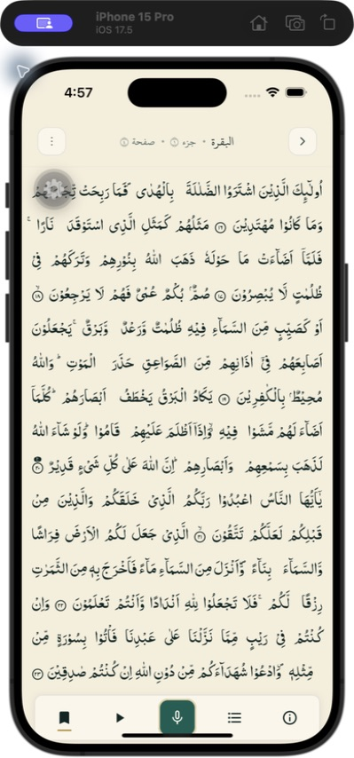

### ISSUE-003 — Mini-player Pause does not pause

**Severity:** Medium  
**Context:** Reader mini player during active recitation.

**Steps to reproduce:**

1. Open a rendered Mushaf page.
2. Tap the reader's **Play** action and wait for the mini player.
3. Tap the mini player's **Pause** button.
4. Wait at least one second and inspect its state/label.

**Expected:** Playback transitions to paused and the control changes to Play.  
**Actual:** It remains in the playing/Pause state. The adjacent Stop action does work.

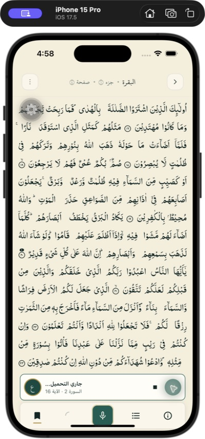

### ISSUE-004 — Full-player Information button is inert

**Severity:** Low  
**Context:** Full recitation player sheet.

**Steps to reproduce:**

1. Start recitation from a reader page.
2. Tap the now-playing area to open the full player.
3. Tap **Information**.

**Expected:** Recitation/ayah information opens, or the control is visibly disabled.  
**Actual:** Nothing changes. Source corroboration: the button is rendered without an `onPress` handler.

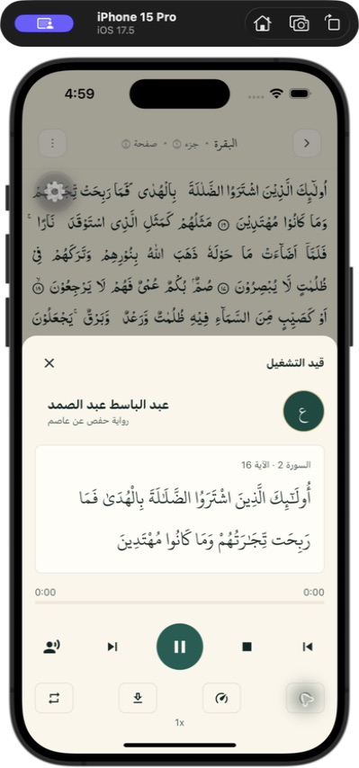

### ISSUE-005 — A started download cannot be cancelled

**Severity:** Medium  
**Context:** Full player download action; online Simulator.

**Steps to reproduce:**

1. Start recitation and open the full player.
2. Tap **Download**; confirm it shows its active/downloading state.
3. Tap **Download** again to cancel.
4. Wait more than six seconds.

**Expected:** A second tap cancels, or a progress/cancel UI explains what is happening.  
**Actual:** The control remains selected/downloading with no progress, completion, error, or cancellation feedback.

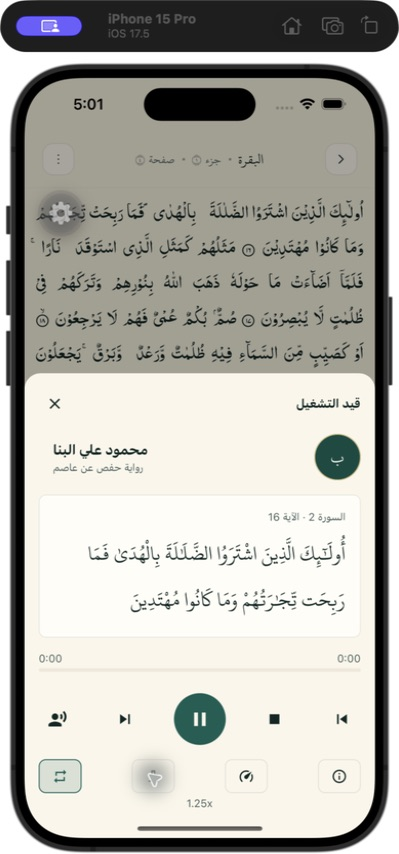

### ISSUE-006 — Bookmarks overflow menu is inert

**Severity:** Low  
**Context:** Bookmarks screen header.

**Steps to reproduce:**

1. Open Bookmarks from the bottom tab or Home brand icon.
2. Tap the three-dot overflow button.

**Expected:** Sorting, management, or another menu opens; alternatively the unfinished control is hidden.  
**Actual:** No visible/state change. Source corroboration labels this handler “wiring TBD.”

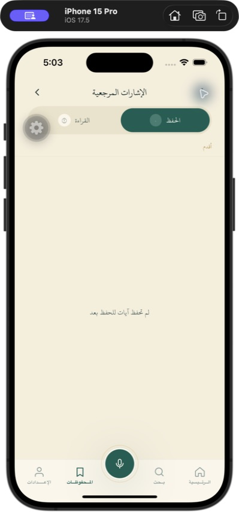

### ISSUE-007 — Swipe-to-delete opens the bookmark instead

**Severity:** Medium  
**Context:** A non-empty Reading bookmark list; RTL Arabic UI.

**Steps to reproduce:**

1. Open Bookmarks → Reading.
2. Swipe a bookmark row horizontally toward either edge.
3. Repeat slowly from the opposite direction.

**Expected:** The row reveals its Delete action without navigating.  
**Actual:** The press/navigation wins and opens the Mushaf reader. No Delete action is revealed. A direct accessibility activation of the hidden Delete label also did not remove the row.

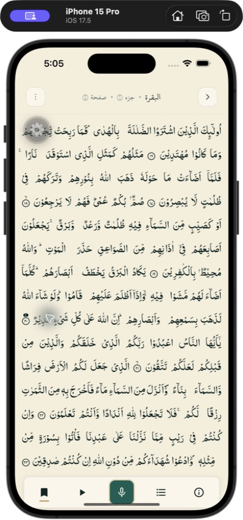

### ISSUE-008 — Surah rows do not open with a standard button tap

**Severity:** Medium  
**Context:** Home → Surahs.

**Steps to reproduce:**

1. Open Home and select the Surahs segment.
2. Tap any Surah row once, as with a normal button/list item.

**Expected:** The Surah reader opens.  
**Actual:** The row merely receives selected styling. Opening depends on an undisclosed double-tap within 300 ms or 400 ms long-press. Rapid automation double-click attempts also did not open it. The accessibility role is “button,” whose standard activation should perform the primary navigation.

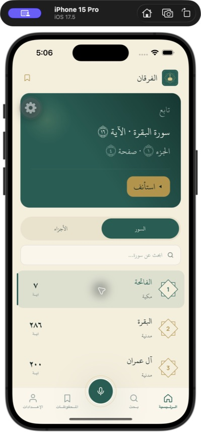

### ISSUE-009 — Juz rows do not open with a standard button tap

**Severity:** Medium  
**Context:** Home → Juz.

**Steps to reproduce:**

1. Open Home and select the Juz segment.
2. Tap Juz 1 once.

**Expected:** `/juz/1` opens.  
**Actual:** The row only becomes selected; the required double-tap/long-press behavior is not communicated. The route itself works when opened through `alfurqan://juz/1`, so this is an entry-control problem rather than a missing page.

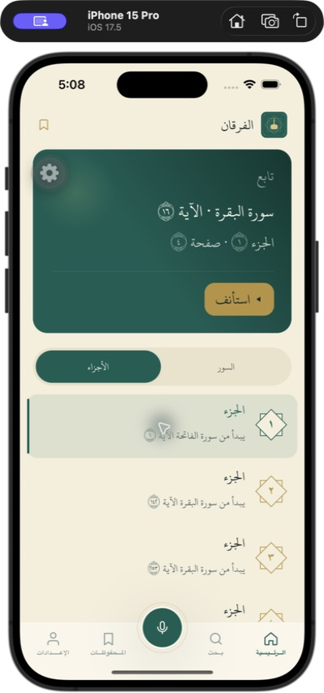

### ISSUE-010 — Search result Play/Copy/Bookmark actions are not accessible

**Severity:** High  
**Context:** Search results; affects VoiceOver/Switch Control and semantic UI automation.

**Steps to reproduce:**

1. Open Search and enter a query that returns an ayah.
2. Inspect the native accessibility elements for the result card.
3. Attempt to navigate independently to Play, Copy, and Bookmark.

**Expected:** Each visible action is a separately labeled, focusable button.  
**Actual:** Only the entire result card is exposed. The nested actions cannot be focused independently, although coordinate presses prove all three visually work.

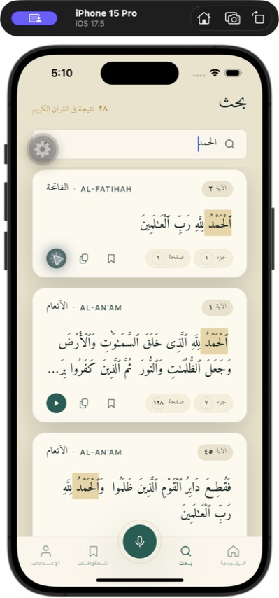

### ISSUE-011 — Settings font and sensitivity controls lack correct accessibility semantics

**Severity:** High  
**Context:** Settings; affects non-touch coordinate users.

**Steps to reproduce:**

1. Open Settings.
2. Inspect the native accessibility tree at Qur'an font size.
3. Try to focus and increment/decrement it as a slider.
4. Scroll to Correction sensitivity and inspect/activate it through accessibility.

**Expected:** Font size is an adjustable slider with value and Increment/Decrement actions; sensitivity is a labeled button or adjustable control.  
**Actual:** Font size is absent as an adjustable element. Sensitivity is exposed as a generic element, not a button. Both work only through sighted coordinate pressing/dragging.

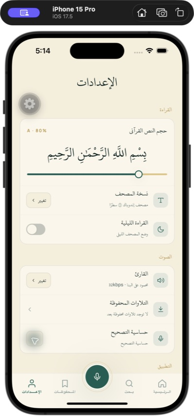

### ISSUE-012 — About is obscured by the tab bar and does nothing

**Severity:** Medium  
**Context:** Settings at maximum scroll position.

**Steps to reproduce:**

1. Open Settings.
2. Scroll to the absolute bottom.
3. Observe the About row behind the floating bottom tab bar.
4. Tap its visible area.

**Expected:** The row is fully reachable above the bar and opens About/legal/version information.  
**Actual:** The row remains partially trapped under the tab bar and has no action. The accessibility tree exposes text rather than a button.

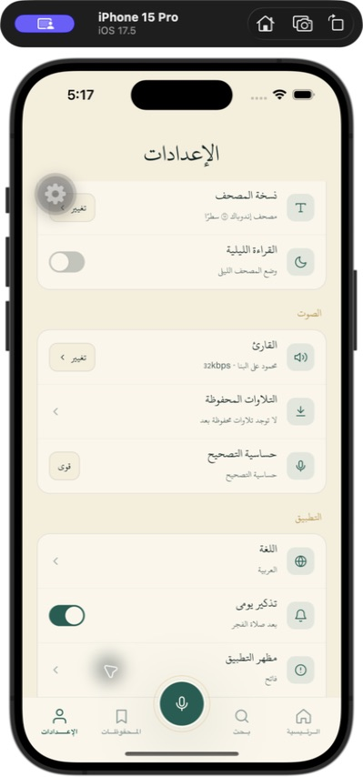

### ISSUE-013 — Several Practice controls are inert

**Severity:** High  
**Context:** Practice modal demo state.

**Steps to reproduce:**

1. Open Practice from the center microphone tab.
2. Tap the flagged red word named in the instruction.
3. Tap **Skip**.
4. Tap the speaker and pause icons beside the main microphone.

**Expected:** The word opens correction detail or playback; Skip advances; speaker/pause control the session.  
**Actual:** None changes the screen or session. Skip is a `Pressable` without a handler; the word and side icons are non-interactive views and are absent from accessibility.

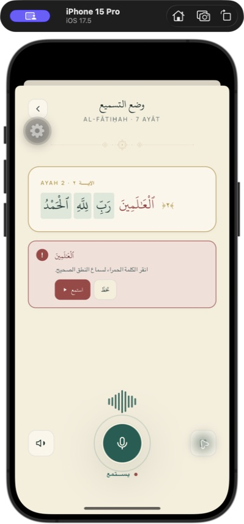

### ISSUE-014 — Practice microphone closes the modal

**Severity:** High  
**Context:** Practice modal.

**Steps to reproduce:**

1. Open Practice.
2. Tap the large microphone labeled **Toggle mic**.

**Expected:** Recording/listening toggles and the user remains in Practice.  
**Actual:** Practice immediately closes and returns to the prior tab. Source corroboration: the microphone handler calls `router.back()`.

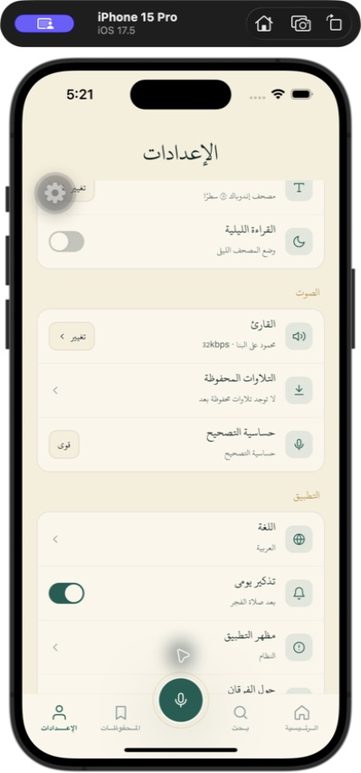

### ISSUE-015 — Ayah selection does not open the action popup

**Severity:** High  
**Context:** Rendered Mushaf page; reproduced in IndoPak.

**Steps to reproduce:**

1. Open a reader page and wait for text.
2. Long-press or make a minimal hold/drag over an ayah.
3. Observe the ayah becomes highlighted.
4. Inspect the screen/accessibility tree for the expected popup actions.

**Expected:** The ayah popup appears with actions such as Play, Bookmark, Copy, Tafsir, and Word-by-word.  
**Actual:** Highlighting occurs but the popup never appears; no popup actions or Close element exist. Downstream popup-button testing is therefore blocked.

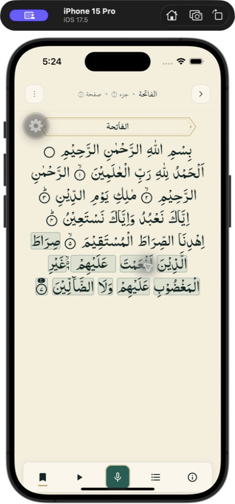

### ISSUE-016 — Horizontal Mushaf swipe is captured by ayah selection

**Severity:** High  
**Context:** Native `PagerView` reader; reproduced on page 1 in Simulator.

**Steps to reproduce:**

1. Open page 1 and wait for all text.
2. Swipe horizontally across the Qur'anic text.
3. Repeat in both directions and from a blank/margin area.
4. Compare the page indicator before and after.

**Expected:** A deliberate horizontal swipe moves to the adjacent page without selecting an ayah.  
**Actual:** Swiping over text selects/highlights an ayah, and margin attempts did not change page 1. Because Computer Use produces mouse-driven Simulator gestures, confirm final gesture thresholds on a physical touch device before release; the repeated Simulator result remains a real regression signal.

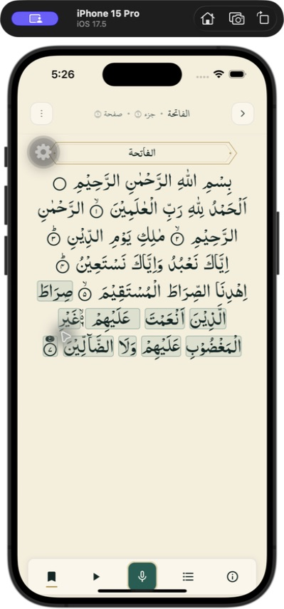

### ISSUE-018 — Search page number ignores the selected Mushaf layout

**Severity:** High  
**Context:** Settings layout = IndoPak 15-line; Search result for An-Nas ayah 1.

**Steps to reproduce:**

1. Open Settings → Mushaf layout and select IndoPak.
2. Open Search and search for An-Nas/its first ayah.
3. Observe the result card's page number.
4. Open the result and compare the reader header.

**Expected:** Search metadata uses the selected layout and displays page 610.  
**Actual:** The result card displays page 604 (Madani's page), while canonical navigation correctly opens IndoPak page 610. This is presentation/data-query isolation, not a canonical-navigation failure.

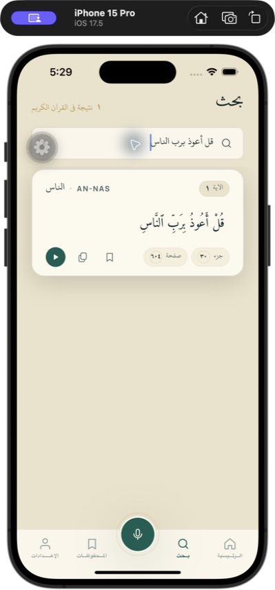

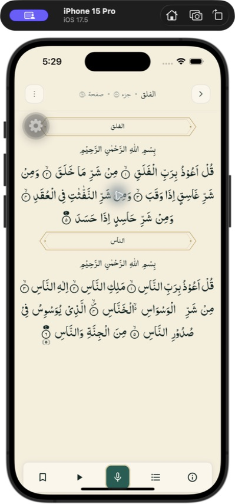

### ISSUE-019 — Onboarding exposes offscreen slides and final CTA to accessibility

**Severity:** High  
**Context:** Fresh app state, visually on onboarding slide 1.

**Steps to reproduce:**

1. Reset only the app's onboarding state or install fresh.
2. Launch and remain on slide 1.
3. Inspect accessibility elements without swiping.
4. Activate the exposed **Get Started** element belonging to slide 3.

**Expected:** Only slide 1 content and its current controls are accessible.  
**Actual:** All three slide headings/bodies, multiple swipe hints, and slide 3's Get Started button are exposed simultaneously. Activating that offscreen button skips onboarding and enters Home.

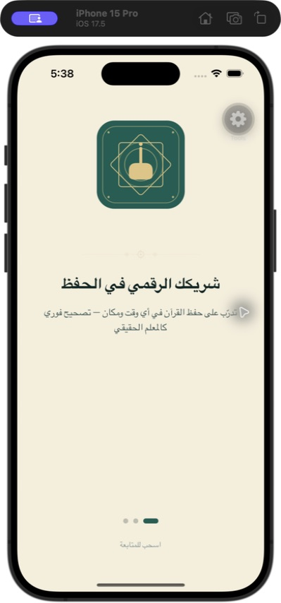

### ISSUE-020 — Onboarding cannot be advanced by swipe in Simulator

**Severity:** High  
**Context:** Fresh app state, onboarding slide 1.

**Steps to reproduce:**

1. Launch the fresh app to onboarding slide 1.
2. Swipe horizontally across the center in both directions.
3. Repeat from an edge and with longer/slower gestures.

**Expected:** The horizontally paged ScrollView advances to slide 2 and then slide 3.  
**Actual:** The first dot and slide-1 content remain active after every attempt. Because the visible CTA exists only on slide 3, a normal sighted user cannot complete onboarding in this run. Physical-device confirmation is recommended because Simulator Computer Use gestures are mouse-driven.

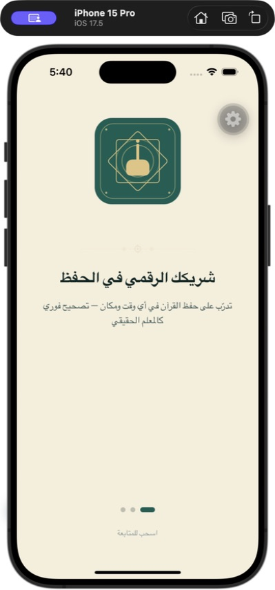

### ISSUE-021 — First reader load is blank without progress feedback

**Severity:** Medium  
**Context:** Fresh onboarding completion → Home Start → first Al-Fatiha reader launch.

**Steps to reproduce:**

1. Complete onboarding on a fresh install/state.
2. Tap **Start** on Home.
3. Observe the reader immediately after its header and toolbar appear.

**Expected:** Qur'anic content appears promptly, or the page shows an explicit loading/progress state.  
**Actual:** The entire sacred-content viewport is blank for several seconds (about four seconds in this run) while header/toolbar remain active. Text eventually appears without feedback.

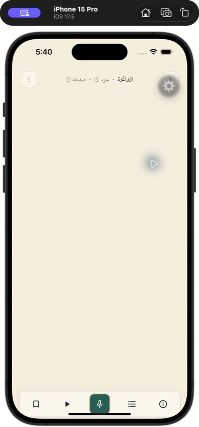

## Confirmed working behavior worth preserving

- Layout choice persists and reader entry is routed through canonical Surah/ayah rather than treating page number as globally stable.
- Search result navigation opens the selected layout's correct page even though the card metadata is wrong.
- Bookmarks retain canonical location and present layout-specific page metadata.
- IndoPak normal/boundary/final pages and Madani final page preserved tested Surah/ayah boundaries.
- Reader mounts a small three-page window around the current page rather than all pages.
- Copy uses semantic Unicode Qur'an text rather than display glyph codes.
- Arabic/English and RTL/LTR presentation changed together; themes/palettes did not lose the active layout/location.
- Bookmark sheet category changes, Remove All, and backdrop dismissal work; the issue is specifically the post-Undo toolbar state.
- Player Stop, Previous, Next, speed, repeat, reciter picker, and Close work.

## Blocked or deliberately non-destructive checks

- Ayah popup actions (Play/Bookmark/Copy/Tafsir/Word-by-word) could not be individually exercised because ISSUE-015 prevents the popup from appearing.
- Saved-recitation deletion could not be exercised because no download completed and ISSUE-005 prevented a clean download/cancel cycle.
- OS-level delivery of the daily reminder was not scheduled/waited for; only the visible/store toggle state was tested.
- Audio audibility was not captured; playback, current-ayah, and player UI states were observed.
- Corrupt/missing content-pack error recovery was not induced because it would require intentionally altering bundled Qur'an data. Existing user/source data was preserved.
- Repeated rows (114 Surahs, 30 Juz, arbitrary Search/Bookmark results) use shared components. Representative first, normal, boundary, and last data cases were tested rather than activating every repeated instance.

## Audit hygiene

- The pre-audit Simulator data was saved at `/tmp/alfurqan-qa-appdata-backup-20260814`.
- After onboarding and destructive bookmark tests, the backup was restored with the app terminated, relaunched, and visually verified.
- Expo Debug Tools' floating gear/“Tools” affordance is a development overlay and was excluded from product-button findings.
- No source changes were discarded, reset, cleaned, staged, committed, pushed, or merged during this audit.

